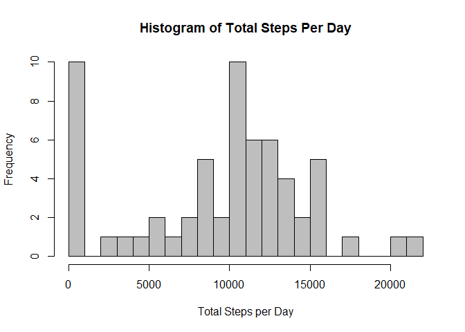
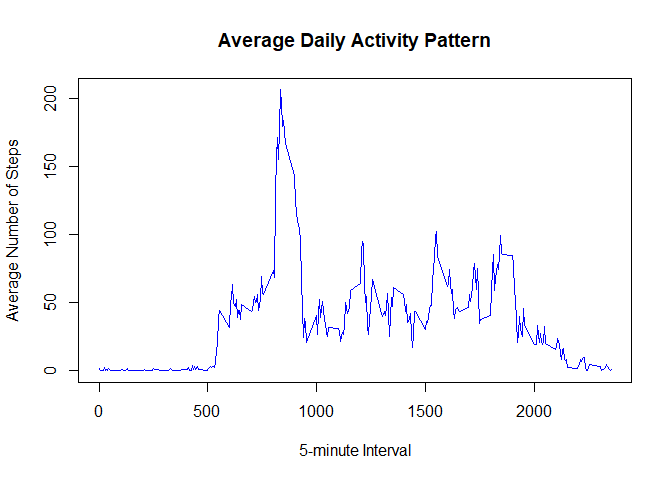
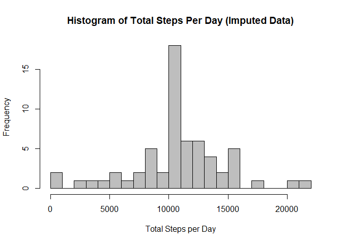
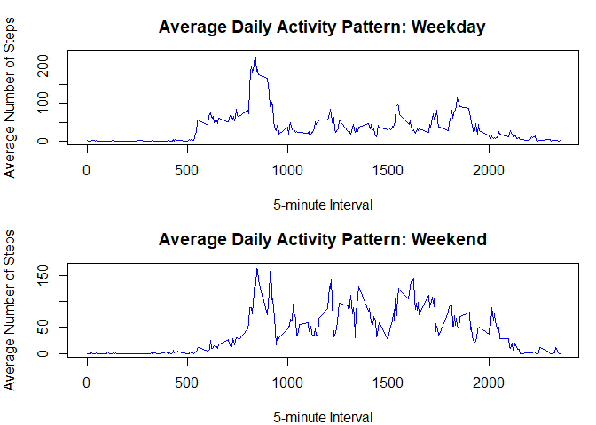

## Loading and preprocessing the data

``` r
# Unzip the file only if 'activity.csv' does not already exist
if (!file.exists("activity.csv")) {
  unzip("activity.zip")
}

# Read the CSV file into a data frame
activity <- read.csv("activity.csv")

# Display the structure of the data frame to understand variable types and data preview
str(activity)
```

```
## 'data.frame':	17568 obs. of  3 variables:
##  $ steps   : int  NA NA NA NA NA NA NA NA NA NA ...
##  $ date    : chr  "2012-10-01" "2012-10-01" "2012-10-01" "2012-10-01" ...
##  $ interval: int  0 5 10 15 20 25 30 35 40 45 ...
```

``` r
# Convert the 'date' column to Date class for easier date operations
activity$date <- as.Date(activity$date, format = "%Y-%m-%d")
```

## What is mean total number of steps taken per day?

``` r
# Calculate total steps per day (ignoring missing values)
steps_per_day <- tapply(activity$steps, activity$date, sum, na.rm = TRUE)

# Plot histogram of total steps per day
hist(steps_per_day,
     main = "Histogram of Total Steps Per Day",
     xlab = "Total Steps per Day",
     col = "grey",
     breaks = 20)
```

<!-- -->

``` r
# Calculate and print the mean and median total steps per day
mean_steps <- mean(steps_per_day)
median_steps <- median(steps_per_day)

mean_steps
```

```
## [1] 9354.23
```

``` r
median_steps
```

```
## [1] 10395
```

## What is the average daily activity pattern?

``` r
# Calculate average steps per 5-minute interval across all days
avg_steps_interval <- tapply(activity$steps, activity$interval, mean, na.rm = TRUE)

intervals <- as.numeric(names(avg_steps_interval))

# Plot time series line plot of average steps per interval
plot(intervals, avg_steps_interval, type = "l",
     xlab = "5-minute Interval",
     ylab = "Average Number of Steps",
     main = "Average Daily Activity Pattern",
     col = "blue")
```

<!-- -->

## Imputing missing values

``` r
# 1. Calculate the total number of missing values (NAs) in the dataset
total_na <- sum(is.na(activity$steps))
total_na  # Display total missing values
```

```
## [1] 2304
```

``` r
# 2. Calculate the mean number of steps for each 5-minute interval (ignoring NAs)
avg_steps_interval <- tapply(activity$steps, activity$interval, mean, na.rm = TRUE)

# 3. Create a new dataset with missing values filled in using the interval mean
activity_imputed <- activity  # Copy original dataset

# Replace NA steps with the mean for that 5-minute interval
activity_imputed$steps <- ifelse(is.na(activity_imputed$steps),
                                avg_steps_interval[as.character(activity_imputed$interval)],
                                activity_imputed$steps)

# 4. Calculate total steps per day using the imputed dataset
steps_per_day_imputed <- tapply(activity_imputed$steps, activity_imputed$date, sum)

# Plot a histogram of total steps taken each day after imputing missing data
hist(steps_per_day_imputed,
     main = "Histogram of Total Steps Per Day (Imputed Data)",
     xlab = "Total Steps per Day",
     col = "grey",
     breaks = 20)
```

<!-- -->

``` r
# 5. Calculate mean and median total steps per day after imputing missing data
mean_imputed <- mean(steps_per_day_imputed)
median_imputed <- median(steps_per_day_imputed)

mean_imputed  # Display mean after imputation
```

```
## [1] 10766.19
```

``` r
median_imputed  # Display median after imputation
```

```
## [1] 10766.19
```

## Are there differences in activity patterns between weekdays and weekends?

``` r
# 1. Create a new factor variable for weekday/weekend
activity_imputed$day_type <- ifelse(weekdays(activity_imputed$date) %in% c("Saturday", "Sunday"),
                                   "weekend", "weekday")
activity_imputed$day_type <- factor(activity_imputed$day_type, levels = c("weekday", "weekend"))

# 2. Calculate average steps per interval by day_type
avg_steps_daytype <- aggregate(steps ~ interval + day_type, data = activity_imputed, mean)

# Split the data into weekday and weekend subsets
weekday_data <- subset(avg_steps_daytype, day_type == "weekday")
weekend_data <- subset(avg_steps_daytype, day_type == "weekend")

# 3. Plot line graphs for weekday and weekend

# Set up plotting area for two plots stacked vertically
par(mfrow = c(2, 1), mar = c(4, 4, 3, 1))

# Weekday plot
plot(weekday_data$interval, weekday_data$steps, type = "l",
     main = "Average Daily Activity Pattern: Weekday",
     xlab = "5-minute Interval",
     ylab = "Average Number of Steps",
     col = "blue")

# Weekend plot
plot(weekend_data$interval, weekend_data$steps, type = "l",
     main = "Average Daily Activity Pattern: Weekend",
     xlab = "5-minute Interval",
     ylab = "Average Number of Steps",
     col = "blue")
```

<!-- -->
